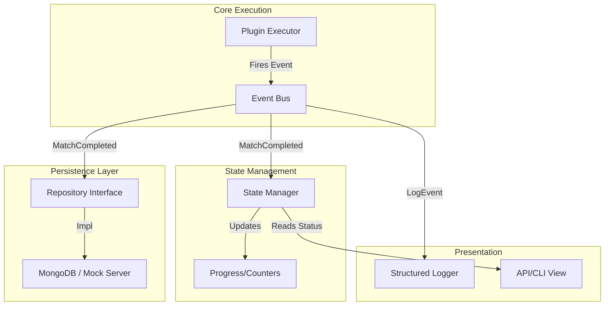

# ARCHIVERR REFUSE - PROFESSIONAL STATE & COMMUNICATION ARCHITECTURE

**Status:** DRAFT / PROPOSAL  
**Target Version:** 3.0.0  
**Inspiration:** Jackett, Sonarr, Radarr, MediaBrowser  

---

## 1. THE PROBLEM: "The Monolith Dictionary"

Currently, Archiverr operates on a "Pass-the-Parcel" model:
1.  Input plugins create a dict.
2.  Executor passes this dict to Plugin A, which adds keys.
3.  Executor passes it to Plugin B, which adds more keys.
4.  Finally, `APIResponseBuilder` tries to format this massive blob into a report.

**Why this is "Dandik" (Subpar):**
-   **Memory Leaks**: The entire state is held in RAM until the process dies. 10k matches = OOM Crash.
-   **No Real-time Visibility**: You can't see match #5's result until match #10000 finishes.
-   **Fragile**: If the dict structure changes, everything breaks.
-   **Tightly Coupled**: The "API Response" format drives the internal logic, which is backward. The API response should be a *view* of the state, not the state itself.

---

## 2. THE SOLUTION: EVENT-DRIVEN STATE MANAGEMENT

We will move to an industry-standard architecture used by tools like Sonarr and Jackett.

### Core Concepts

#### A. The Global State Manager (Singleton)
The "Truth". It holds the active execution context but **does not store data indefinitely**.
-   It knows: "We are running", "Match #5 is processing", "Match #4 failed".
-   It **does not** hold the payload of Match #1 once it's done. It offloads it to the Persistence Layer.

#### B. The Event Bus (Pub/Sub)
Decouples execution from storage and reporting.
-   **Executor**: "I finished Match #5 with these results." -> fires `MatchCompletedEvent`
-   **State Manager**: Listens -> Updates progress counters.
-   **DB Writer**: Listens -> Writes Match #5 to MongoDB/JSON immediately.
-   **CLI/UI**: Listens -> Prints "Match #5 Done" to console.

#### C. The Persistence Layer (Repository Pattern)
Abstracts *where* data lives.
-   `IExecutionRepository`: `save_match()`, `get_match()`, `update_status()`.
-   **Implementations**:
    -   `MemoryRepository`: (Dev/Test) Keeps it in a list.
    -   `JsonFileRepository`: (Current) Appends to a file.
    -   `MongoRepository`: (Target) Writes to MongoDB.
    -   `MockServerRepository`: (Transition) Posts to a local JSON server.

---

## 3. ARCHITECTURE DIAGRAM



---

## 4. INDUSTRY STANDARDS (How the Pros do it)

### Sonarr / Radarr (C#)
-   **DatabaseContext**: They use SQLite/Postgres as the source of truth.
-   **JobManager**: Background tasks run and update the DB.
-   **SignalR**: Real-time events sent to UI when DB changes.
-   **State**: They don't pass massive objects. They pass IDs (`EpisodeId`). If a plugin needs data, it queries the Service/DB.

### Jackett (C#)
-   **IndexerManager**: Manages lifecycle of indexers.
-   **Cache**: Results are cached immediately, not held in RAM for the whole session.

### Archiverr 3.0 Approach
We will adopt the **"Stream Processing"** model suitable for Python.
1.  **Input**: Stream of files.
2.  **Process**: Transform file -> Metadata.
3.  **Output**: Write to DB/Stream.
4.  **Forget**: Drop from RAM.

---

## 5. IMPLEMENTATION PLAN

### Phase 1: The Foundation (State & Events)
Create `src/archiverr/core/state/`.

1.  **`EventBus`**: Simple synchronous list of subscribers (async ready).
2.  **`Events`**:
    -   `ExecutionStarted`
    -   `MatchFound(input_data)`
    -   `PluginStarted(match_id, plugin_name)`
    -   `PluginFinished(match_id, plugin_name, result)`
    -   `MatchCompleted(match_id, final_result)`
3.  **`StateManager`**:
    -   Subscribes to all above.
    -   Maintains `current_stats` (success/fail counts).
    -   **Crucially**: Does NOT keep the full list of matches in RAM.

### Phase 2: The Repository Pattern
Create `src/archiverr/core/persistence/`.

```python
class IRepository(ABC):
    @abstractmethod
    def save_match(self, match_data: dict): pass
    
    @abstractmethod
    def update_execution_status(self, status: dict): pass
```

### Phase 3: The Mock Server (Transition)
Instead of jumping straight to MongoDB, we build a `MockServerRepository`.
-   **Setup**: User runs `json-server --watch db.json`.
-   **Repo**: Sends HTTP POST requests to `localhost:3000/matches`.
-   **Benefit**: Validates the "Write-as-you-go" architecture without needing a full DB setup yet.

### Phase 4: Refactoring Executor
Modify `Executor` to stop building the `result` dict and instead:
1.  Generate a `match_id` (UUID).
2.  Fire `PluginFinished` events.
3.  Return a lightweight object (status only).

### Phase 5: The "New" API Response
The `api_response.json` file is no longer the "state". It is a report generated by querying the Repository at the end of execution.

---

## 6. MOCK SERVER STRATEGY

To simulate the Mongo DB environment immediately:

1.  **Tool**: `json-server` (npm) or a simple Python `http.server` wrapper.
2.  **Endpoints**:
    -   `POST /executions`: Create new run.
    -   `POST /executions/:id/matches`: Add a match.
    -   `PATCH /matches/:id`: Update match with plugin results.

**Workflow:**
1.  Archiverr starts -> `POST /executions` -> Get `execution_id`.
2.  Scanner finds file -> `POST /matches` (linked to `execution_id`).
3.  TMDB finishes -> `PATCH /matches/:id` (append tmdb data).
4.  **End**: The "API Response" is just `GET /executions/:id?_embed=matches`.

This proves the architecture works before writing a single line of MongoDB code.
